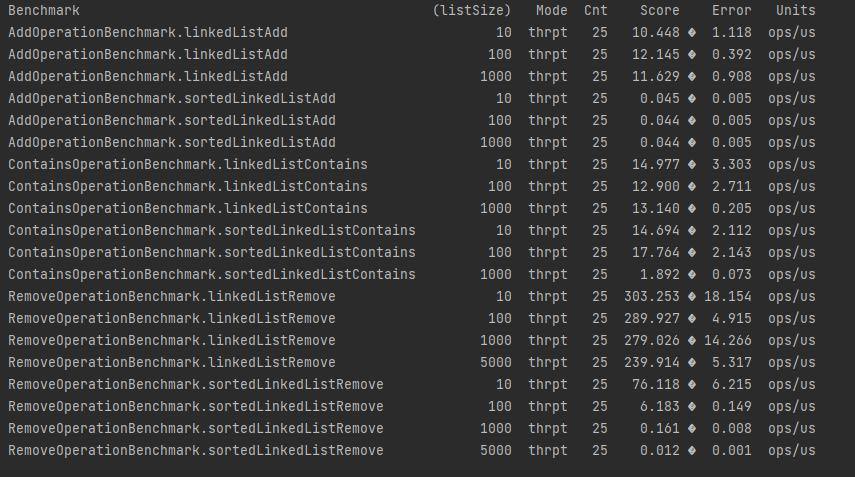

# SortedLinkedList
- Extends Java LinkedList 
- Right now working with Integer and String only. Technically should work with any Comparable object
- Remove and contains method should have log(n) complexity 
- Was curious about execution times of add, remove, contains operations si I added benchmark to compare sorted and unsorted linked list
  - unsurprisingly add was much faster for unsorted list
  - but what is surprising is that both remove and contains operations are slower in sortedLinkedList. Below are attached benchmark results. Results are in operations per microsecond
  - no further investigation was done because performance was not part of task
  - 